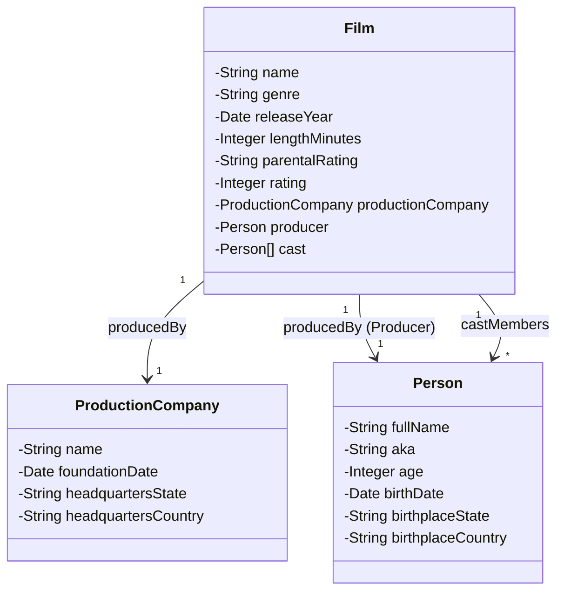

# Film API - Bootcamp DIO 🚀
Java RESTful API criada para o Decola Tech 

## Descrição 📖
Este projeto é uma **API de filmes** desenvolvida como parte do **Bootcamp da DIO**.  

## Diagrama de Classes

